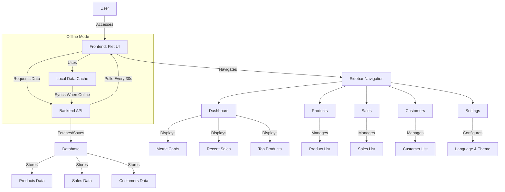

# OfflinePOS - Premium

## Overview
OfflinePOS is a premium Point of Sale (POS) system designed for world-class supermarkets, offering an offline-first approach with a modern, user-friendly interface. Built using Python and Flet, this application provides robust features for managing products, sales, customers, and settings, with support for multiple languages and themes. It includes a responsive sidebar navigation, real-time data polling, and a sleek design inspired by systems like Square and Shopify POS.

## Features
- **Dashboard**: Displays key metrics (Total Sales, Sale Count, Daily Sales) and lists for Recent Sales and Top Products.
- **Products**: Manage product inventory with sortable, filterable lists and edit/delete functionality.
- **Sales**: Track sales with view details and receipt generation, including unauthorized read-only access.
- **Customers**: Add, edit, and delete customer records with enhanced list features.
- **Settings**: Customize language (English, French, Spanish) and theme (Light/Dark mode).
- **Offline-First**: Designed to function seamlessly with local data when offline, syncing with the server when online.
- **Real-Time Updates**: Polls data every 30 seconds and supports live reload on code changes.

## System Architecture
Below is a diagram illustrating the architecture and data flow of OfflinePOS:



## Prerequisites
- Docker
- Docker Compose
- Python 3.11
- Internet connection for initial setup and API calls

## Installation
1. Clone the repository:
   ```bash
   git clone https://github.com/wabukowabuko/OfflinePOS.git
   cd OfflinePOS
   ```
2. Build and start the Docker containers:
   ```bash
   docker-compose down
   docker-compose up --build
   ```
3. Access the application at `http://localhost:8000` in your browser.

## Usage
- **Login**: Use `admin`/`password123` to access the admin dashboard.
- **Navigation**: Use the sidebar to switch between Dashboard, Products, Sales, Customers, and Settings.
- **Data Management**: Add products, sales, and customers via the respective tabs. Edit or delete entries as needed.
- **Settings**: Change language or theme from the Settings tab.
- **Logout**: Click the Logout button on the Dashboard to return to the login screen.

## Testing
1. Verify tab functionality:
   - Dashboard: Check metric cards and lists.
   - Products/Sales/Customers: Test sorting, filtering, and actions.
   - Settings: Switch languages and themes.
2. Test offline mode by disconnecting from the internet and ensuring local data persists.
3. Monitor logs with:
   ```bash
   docker-compose logs offlinepos
   ```
4. Add sample data via API (e.g., `POST http://localhost:5000/api/products`) to populate lists.

## Configuration
- **API Endpoint**: Defaults to `http://localhost:5000/api/`. Update `main.py` if using a different backend.
- **Language**: Modify `current_language` in `main.py` to set the default (e.g., "en", "fr", "es").
- **Theme**: Adjust `current_theme` in `main.py` to `ft.ThemeMode.DARK` for default dark mode.

## Contributing
1. Fork the repository.
2. Create a feature branch:
   ```bash
   git checkout -b feature-name
   ```
3. Commit changes:
   ```bash
   git commit -m "Description of changes"
   ```
4. Push to the branch:
   ```bash
   git push origin feature-name
   ```
5. Open a pull request.

## License
This project is licensed under the MIT License. See the [LICENSE](LICENSE) file for details.

## Contact
For issues or support, open an issue on the GitHub repository or contact the maintainers.

## Version
- Current Version: 1.0.0
- Release Date: May 09, 2025
